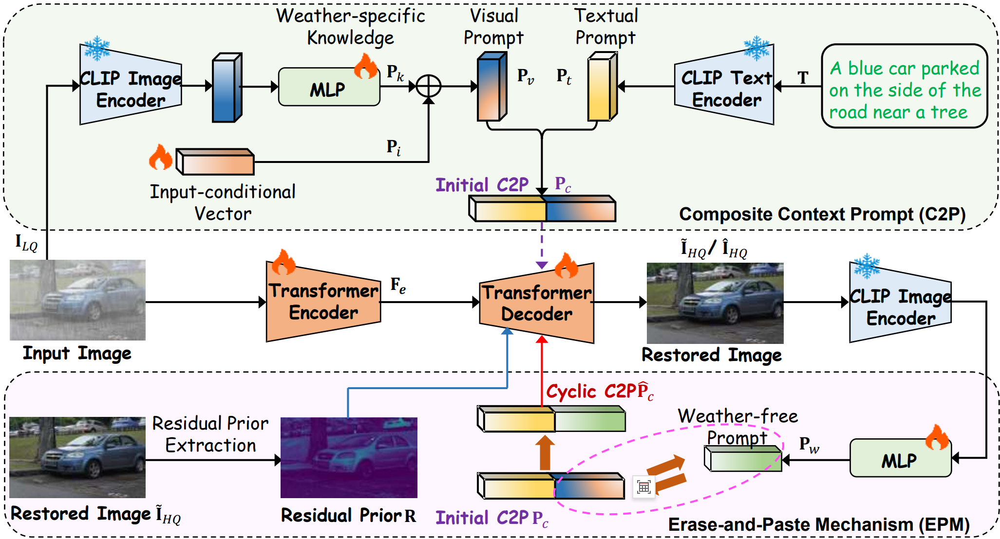

# Prompt to Restore, Restore to Prompt: Cyclic Prompting for Universal Adverse Weather Removal


[**Prompt to Restore, Restore to Prompt: Cyclic
Prompting for Universal Adverse Weather Removal**]() 

CyclicPrompt is an innovative cyclic prompt approach designed to enhance the effectiveness, adaptability, and generalizability of UAWR. 




<!-- 
### News
<!-- #### 2024 -->


## 🔓 Installation
```
git clone https://github.com/RongxinL/CyclicPrompt.git
cd CyclicPrompt
conda create -n cyclicPrompt python=3.8
conda activate cyclicPrompt
pip install -r requirements.txt

python setup.py develop --no_cuda_ext
```

## 🧩 Datasets

- Adverse Weather

| Task | Train Dataset | Test Dataset |
|:----------:|:------:|:----------:|
| Rain+fog | [AllWeather](https://github.com/jeya-maria-jose/TransWeather) | [Test1](https://github.com/liruoteng/HeavyRainRemoval) |
| Snow | [AllWeather](https://github.com/jeya-maria-jose/TransWeather) | [Snow100K-L、Snow100K-S](https://sites.google.com/view/yunfuliu/desnownet) |
| Raindrop | [AllWeather](https://github.com/jeya-maria-jose/TransWeather)  | [TestA](https://github.com/rui1996/DeRaindrop) |


- 5D 

| Task | Train Dataset | Test Dataset |
|:----------:|:------:|:----------:|
| Rain | [Rain100L](https://www.icst.pku.edu.cn/struct/Projects/joint_rain_removal.html)+[SOTS](https://sites.google.com/view/reside-dehaze-datasets/reside-v0)+[WED/BSD400](https://www2.eecs.berkeley.edu/Research/Projects/CS/vision/bsds/)+[LOL](https://daooshee.github.io/BMVC2018website/)+[GoPro](https://seungjunnah.github.io/Datasets/gopro.html) | [Rain100L](https://www.icst.pku.edu.cn/struct/Projects/joint_rain_removal.html) |
| Haze | [Rain100L](https://www.icst.pku.edu.cn/struct/Projects/joint_rain_removal.html)+[SOTS](https://sites.google.com/view/reside-dehaze-datasets/reside-v0)+[WED/BSD400](https://www2.eecs.berkeley.edu/Research/Projects/CS/vision/bsds/)+[LOL](https://daooshee.github.io/BMVC2018website/)+[GoPro](https://seungjunnah.github.io/Datasets/gopro.html) | [SOTS-Outdoors](https://sites.google.com/view/reside-dehaze-datasets/reside-v0) |
| Noise| [Rain100L](https://www.icst.pku.edu.cn/struct/Projects/joint_rain_removal.html)+[SOTS](https://sites.google.com/view/reside-dehaze-datasets/reside-v0)+[WED/BSD400](https://www2.eecs.berkeley.edu/Research/Projects/CS/vision/bsds/)+[LOL](https://daooshee.github.io/BMVC2018website/)+[GoPro](https://seungjunnah.github.io/Datasets/gopro.html) | [BSD68](https://www2.eecs.berkeley.edu/Research/Projects/CS/vision/bsds/) |
| Motion Blur| [Rain100L](https://www.icst.pku.edu.cn/struct/Projects/joint_rain_removal.html)+[SOTS](https://sites.google.com/view/reside-dehaze-datasets/reside-v0)+[WED/BSD400](https://www2.eecs.berkeley.edu/Research/Projects/CS/vision/bsds/)+[LOL](https://daooshee.github.io/BMVC2018website/)+[GoPro](https://seungjunnah.github.io/Datasets/gopro.html) | [GoPro](https://seungjunnah.github.io/Datasets/gopro.html) |
| Low Light| [Rain100L](https://www.icst.pku.edu.cn/struct/Projects/joint_rain_removal.html)+[SOTS](https://sites.google.com/view/reside-dehaze-datasets/reside-v0)+[WED/BSD400](https://www2.eecs.berkeley.edu/Research/Projects/CS/vision/bsds/)+[LOL](https://daooshee.github.io/BMVC2018website/)+[GoPro](https://seungjunnah.github.io/Datasets/gopro.html) | [LOL](https://daooshee.github.io/BMVC2018website/) |


## 🚀 Usage
The model weight can be downloaded from [Model weights](https://drive.google.com/file/d/1S7RLqnwhNG1cdwvDmAyrsbWaQ1F57XOg/view?usp=drive_link)

### Train

1. generating csv file for trainning and testing by
      python scripts/get_caption.py
      
      the csv file should be organized in the following format

```
gt_path	lq_path	caption	degradation
</path/to/gt> </path/to/lq>	<caption> <degradation>
```

2. run python basicsr/train.py -opt train.yml

### Test
```
python basicsr/train.py -opt test.yml
```

## Citation
```
@article{liao2025prompt,
  title={Prompt to Restore, Restore to Prompt: Cyclic Prompting for Universal Adverse Weather Removal},
  author={Liao, Rongxin and Li, Feng and Wei, Yanyan and Shi, Zenglin and Zhang, Le and Bai, Huihui and Wang, Meng},
  journal={arXiv preprint arXiv:2503.09013},
  year={2025}
}
```

## Thanks
The code references [Restormer](https://github.com/swz30/Restormer) and based on [BasicSR](https://github.com/XPixelGroup/BasicSR). Thanks for these excellent works! 
